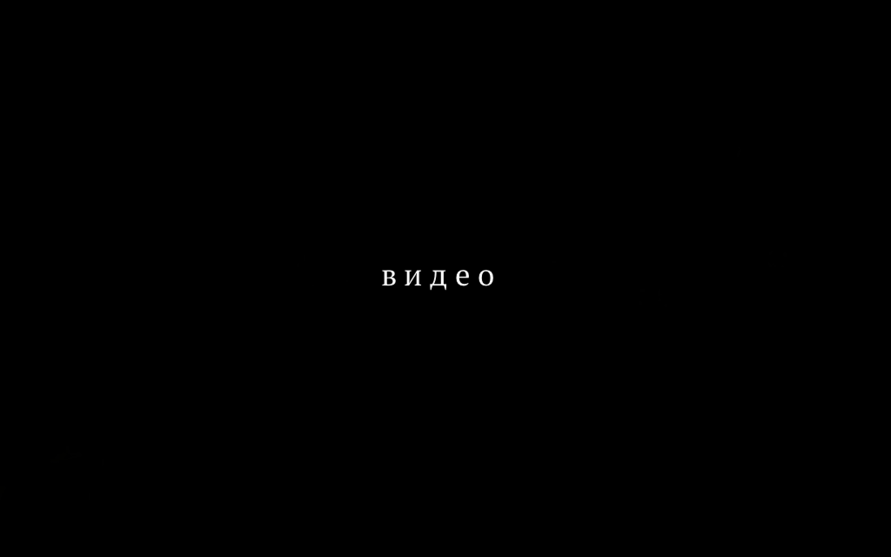

```{r setup03, include=FALSE}
knitr::opts_chunk$set(message = FALSE, warning = FALSE, comment = "")
options(scipen=999)
library(tidyverse)
theme_set(theme_bw())
```

# Практическое занятие по Национальному корпусу русского языка

```{r img0_3, echo=FALSE, out.width = '75%'}

```
