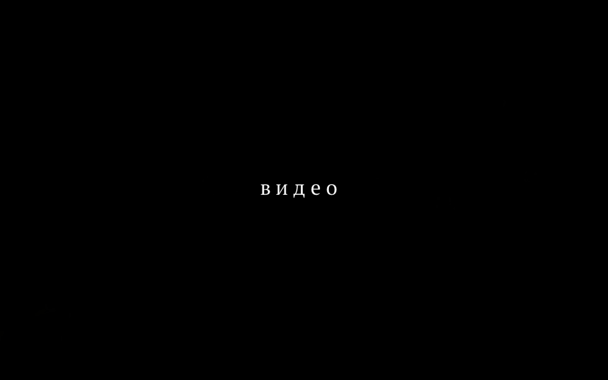
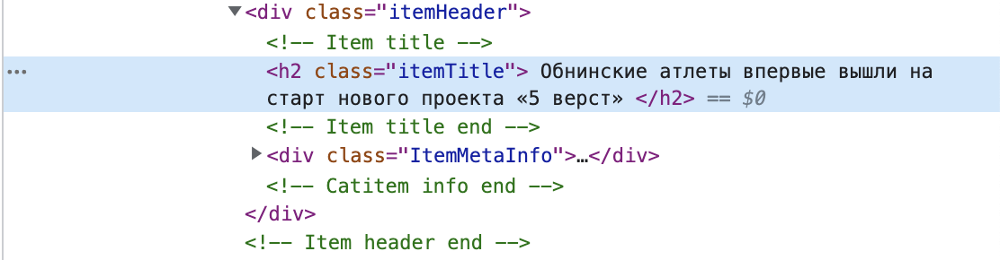
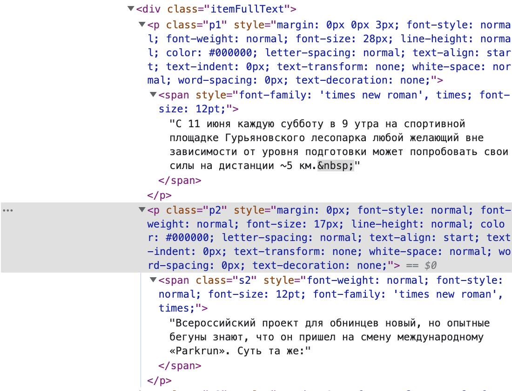
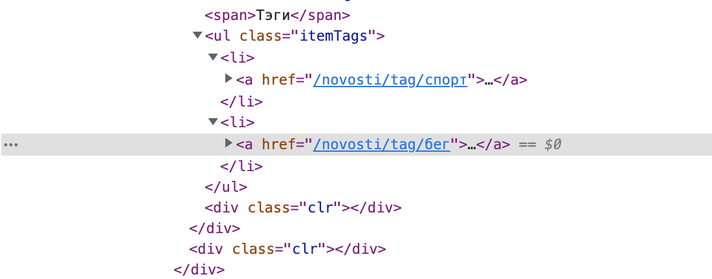
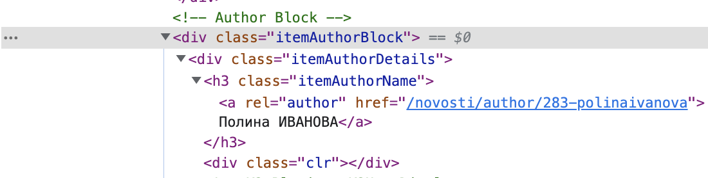

```{r setup06, include=FALSE}
knitr::opts_chunk$set(message = FALSE, warning = FALSE, comment = "")
options(scipen=999)
library(tidyverse)
library(checkdown)
theme_set(theme_bw())
```

# Как собрать корпус самостоятельно. Краулеры.

```{r img0_6, echo=FALSE, out.width = '75%'}

```

## Что такое краулеры
Краулеры - программы, которые собирают информацию со страниц сайтов. На многих сайтах стоят ограничения на использование таких программ, так как это, как минимум, может уронить сервер. В связи с этим, использовать краулеры надо осторожно, чтобы не заблокировали по IP и чтобы вы не навредили серверу. 

## Википедия
Для скачивания Википедии есть специальная библиотека. Одна из фишек Википедии: возможность скачать данные для большого количества языков. Например, если вам понадобился ломбардский язык, его можно выкачать из Википедии. 
Импортируем библиотеку
```{python, eval = FALSE, python.reticulate = FALSE}
import wikipedia
```

Пишем функцию для выкачивания определенного языка
```{python, eval = FALSE, python.reticulate = FALSE}
def get_texts_for_lang(lang, n=10):
    wiki_content = [] ## сюда будем записывать данные со страницы
    wikipedia.set_lang(lang) ## здесь выбираем язык
    pages = wikipedia.random(n) ## выбираем рандомную статью
    for page_name in pages:
        try:
            page = wikipedia.page(page_name)
            
            wiki_content.append("%s\n%s" % (page.title, page.content.replace('=', ''), page.categories))
        except wikipedia.exceptions.WikipediaException: ## если не выкачивается, пропускаем
            print("Skip %s" % page_name)
    return wiki_content
```


Скачаем данные для ломбардского языка.
```{python, eval = FALSE, python.reticulate = FALSE}
lang = 'lmo' ## можно заменить на любой другой нужный вам язык, статьи на котором есть в Вики
wiki_texts = get_texts_for_lang(lang, 1000)
print(lang, len(wiki_texts))
```

## Парсинг газет
А если нам нужна не Википедия, а какой-то конкретный сайт? Необходимо воспользоваться библиотекой BeautifulSoup и urllib.request. 

Импортируем библиотеки
```{python, eval = FALSE, python.reticulate = FALSE}
from bs4 import BeautifulSoup 
from urllib.request import urlopen
```

Возьмем какую-нибудь газету и выкачаем оттуда новости 
```{python, eval = FALSE, python.reticulate = FALSE}
url = 'http://ngregion.ru/novosti'
html_doc = urlopen(url).read()
soup = BeautifulSoup(html_doc, 'html.parser')
```

Теперь у нас есть soup, в котором лежит скаченная страница url. Что с этим делать? Нам необходимо вытащить со страницы текст новости и метаданные. Для того, чтобы понять, как их достать, необходимо посмотреть на устройство страницы html. Для этого неободимо кликнуть на правую кнопку мыши и перейти на "Просмотр кода страницы" (для Google Chrome). Базовые примеры можно посмотреть [здесь](https://www.crummy.com/software/BeautifulSoup/bs4/doc.ru/bs4ru.html#id7). 

Посмотрим на наш сайт. 

Заголовок текста находится внутри класса заголовка.
```{r img3, echo=FALSE, out.width = '100%'}

```

Сам текст расположен ниже и устроен чуть сложнее. Весь он лежит под тегом div class="itemFullText", но разбит на кусочки. 
```{r img4, echo=FALSE, out.width = '100%'}

```

Можем еще дополнительно достать теги для статьи. 
```{r img5, echo=FALSE, out.width = '100%'}

```

Может быть нам понадобится и автор. 
```{r img6, echo=FALSE, out.width = '100%'}

```

Пример выкачки статьи. Последовательно выкачиваем название, текст, автора и теги.
```{python, eval = FALSE, python.reticulate = FALSE}
from bs4 import BeautifulSoup 
from urllib.request import urlopen

#ищем название статьи
title = soup.find("h2", attrs={"class": "itemTitle"}).get_text()
title = title.replace('\n', '') #убираем лишние символы
title = title.replace('\t', '')

#достаем текст
text = soup.find("div", attrs={"class": "itemFullText"}).get_text()
text = text.replace('\n', '')
text = text.replace('\xa0', '')

#ищем автора
author = soup.find("h3", attrs={"class": "itemAuthorName"}).get_text()
author = author.replace('\n', '')

#ищем теги
tags = soup.find("ul", attrs={"class": "itemTags"}).get_text()
tags = tags.split('\n')[1:-1] #делаем список тегов
```

```{block, type = "rmdtask"}
Попробуйте теперь самостоятельно написать строку поиска названия и текста для [газеты](https://pressaobninsk.ru/). Например для поиска автора выше мы использовали 
soup.find("h3", attrs={"class": "itemAuthorName"}).get_text(). 
В таком же виде укажите ответы для данного издания.
```

Введите функцию для поиска названия статьи

```{r, echo=FALSE, results='asis'}
check_question(answer =  'soup.find("div", attrs={"class": "news-title__name"}).get_text()')
```

Введите функцию для поиска текста статьи

```{r, echo=FALSE, results='asis'}
check_question(answer =  'soup.find("div", attrs={"class": "news-content"}).get_text()')
```

